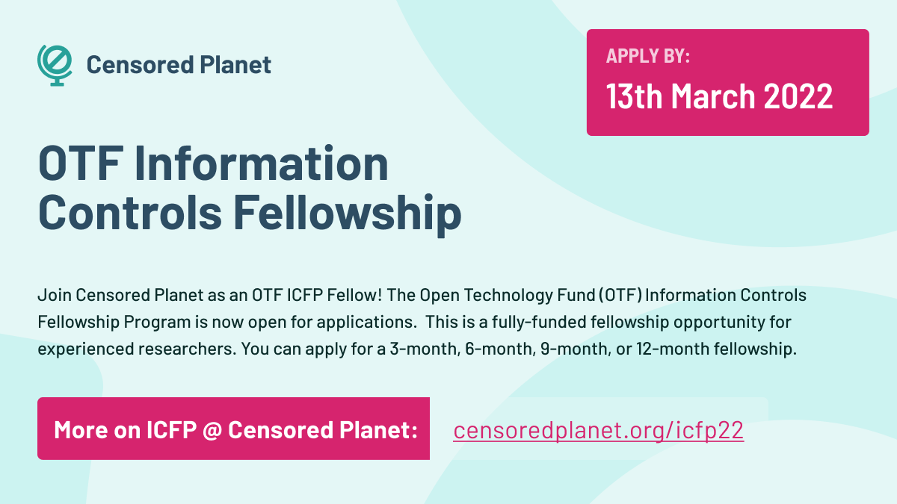

### Apply

[OTF](https://www.opentech.fund/funds/icfp/) is now accepting applications for the ICFP fellowship from a variety of backgrounds and disciplines and can include students and junior to mid-career practitioners. **Application deadline is March 13, 2022.**

The fellowship can be three, six, nine or twelve months. It is usually offered to postdoctoral, doctoral students, and experienced researchers with demonstrated ability and expertise, with a monthly stipend of $5,000 USD and a travel and equipment stipend.

**Apply to join Censored Planet Lab at University of Michigan** through the OTF [website](https://www.opentech.fund/funds/icfp/). If you have any questions about working under ICFP at Censored Planet Lab, please contact us at [censoredplanet@umich.edu](mailto:censoredplanet@umich.edu).

{: .center }

### Background on ICFP and Censored Planet Lab
[The Information Controls Fellowship Program](https://www.opentech.fund/funds/icfp/) (ICFP) cultivates research, outputs, and creative collaboration on topics related to repressive Internet censorship and surveillance. The program supports examination into how governments in countries, regions, or areas of OTF’s core focus are restricting the free flow of information, cutting access to the open Internet, and implementing censorship mechanisms, thereby threatening the ability of global citizens to exercise basic human rights and democracy; work focused on mitigation of such threats is also supported.

[Censored Planet Lab](https://censoredplanet.org/) research lies at the intersection of network security, censorship, and Internet measurement. We build scalable techniques and systems to protect users’ Internet experiences from disruption, surveillance, and digital inequity. We welcome research proposals from fellowship candidates for research projects related to our areas of focus as described below:

**Censored Planet Observatory:** Censored Planet is a platform that provides continuous, global data about Internet censorship practices in countries around the world. It builds on our long line of work developing remote censorship measurement techniques. Our group operates several of these systems, curates the data, and publishes continuous datasets about the reachability of thousands of sensitive websites from more than 221 countries. In partnership with Google Jigsaw, we recently launched a cloud-based data analysis pipeline and a visualization dashboard, facilitating use of our data by more than 100 organizations spanning research and human rights advocacy. Read more about this project at [https://censoredplanet.org](https://censoredplanet.org).

**VPNalyzer:** VPNalyzer aims to analyze the commercial VPN ecosystem through three parallel efforts: a cross-platform user- facing tool that facilitates rigorous, efficient, and continuous checks of VPNs’ security and privacy; large-scale user studies to understand the needs of VPN users; and qualitative studies surveying VPN providers to understand their technical and operational challenges and to uncover dark patterns in their operations, pricing, and marketing. VPNalyzer was awarded the Consumer Reports Digital Lab fellowship, read more about this project at [https://vpnalyzer.org](https://vpnalyzer.org).

**Internet Geo-equity:** The Internet is becoming increasingly regionalized due to sanctions, financial regulations, copyright and licensing rights, perceived abuse, or a perceived lack of customers. We conduct measurement studies to understand how these issues affect user’s experience from different geolocation (geo-equity). Read 403 Forbidden for the web ecosystem, and see [https://geodiff.app](https://geodiff.app) for the mobile ecosystem.

**Rapid Response:** Our lab also takes on rapid-focus research in response to new developments of censorship events around the globe. Some of our high profile rapid-response investigations include [Russia’s throttling of Twitter](https://censoredplanet.org/throttling), [Filtering of Covid-19 Websites](https://censoredplanet.org/covid), and [Kazakhstan HTTPS Interception](https://censoredplanet.org/kazakhstan). Please check our [reports](https://censoredplanet.org/reports) for more information.

