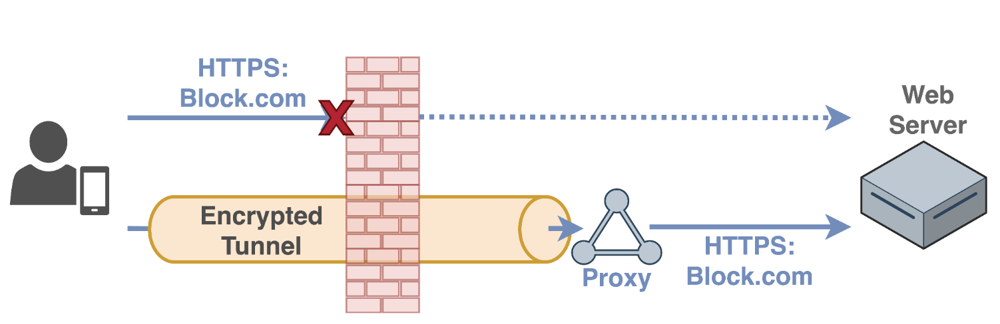
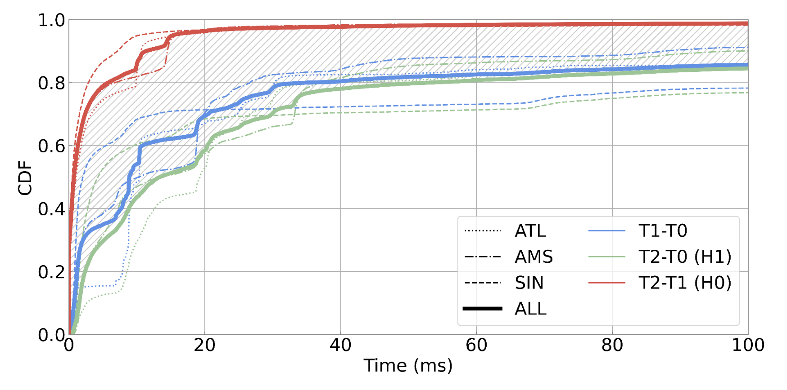
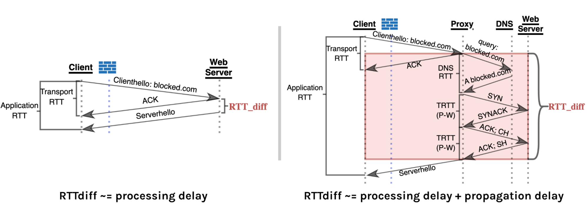

_This post highlights findings discussed in the [NDSS 2025](https://www.ndss-symposium.org/ndss2025) paper [The Discriminative Power of Cross-layer RTTs in Fingerprinting Proxy Traffic](https://www.ndss-symposium.org/ndss-paper/the-discriminative-power-of-cross-layer-rtts-in-fingerprinting-proxy-traffic/)._

Users' Internet traffic has seen more and more interference from firewalls and middleboxes along the network path. This includes censorship, filtering, and throttling of user traffic. The dominant way to get around these restrictions and interferences is to send your traffic through an encrypted tunnel. A user behind a firewall encapsulates their traffic inside a tunnel, which carries the traffic to a proxy server outside the censor's control and then forwards the traffic to its final destination. The tunnel encrypts the traffic within, so that even if the user is trying to access a blocked website, the firewall will not see this, and will not be triggered.

**Figure 1:** _Circumvention using an encrypted tunnel. This diagram illustrates how users bypass censorship using encrypted tunnels. When direct access to block.com is prohibited by a firewall, users establish an encrypted tunnel to a proxy server outside the censored region. The proxy then accesses the blocked website on the user's behalf, allowing the data to flow through the encrypted tunnel without the firewall being able to inspect the contents or determine the actual destination._

Because tunnels make it difficult to inspect the traffic contents inside, in many cases, restrictions like censorship and filtering often come **with blocking the tunneling protocols themselves.** This leads to an **ongoing arms race** building and detecting tunneling protocols. On one side, you have proxy systems using different obfuscations to hide the presence of tunnels, like shadowsocks, trojan, or v2ray. On the other side, censors and firewalls keep trying to see through these obfuscations to stop circumvention.

In this work, we further this arms race. So far, most fingerprinting efforts, whether actually deployed or just proposed, target specific flaws of an individual obfuscation protocol. Proxy developers then patch these flaws and come up with new obfuscations, often assuming a resource-limited censor cannot keep up with all the variants.

We examine this assumption in this work. We note that censors don't actually need to recognize which obfuscation you're using, only that you're using a tunnel at all. So, fingerprinting tunnels themselves are more powerful than just fingerprinting individual obfuscation protocols. And, this is what we show to be feasible in this work.

The fingerprint we're going to discuss in this blog post is protocol-agnostic, because it isn't tied to any specific obfuscation, but rather exploits a more fundamental property shared by every transport layer proxying and tunneling tool.

## Fingerprint Formulation

The key observation that leads to this fingerprint is that any form of tunneling would misalign the notion of "sessions" across different network layers. With most tunneling connections, the network and transport layers terminate at the proxy – so there's one transport session from the client to the proxy, and another from the proxy to the web server.
Meanwhile, the application-layer remains end-to-end, directly from the client to the web server. This allows the proxy to relay traffic, while also preserving end-to-end features like TLS. But, because these layers terminate in different places, the network paths they take span different distances, which can cause a mismatch in the round-trip times between the transport-layer and the application-layer.
Here's a concrete example. In a direct HTTPS connection, after the handshake, the client sends a clienthello, and receives an acknowledgement from the server, at one transport layer RTT; and then finally receives the serverhello after one application layer RTT. The difference here is simply the time the web server takes to process the request.

**Figure 2:** _This graph shows the distribution of round-trip time differences across different measurement locations (ATL, AMS, SIN) and scenarios. The red curve (T2-T1) represents the RTT difference for direct connections (H0 hypothesis), while the green curve (T2-T0) shows RTT differences for proxied connections (H1 hypothesis). The shaded area between the curves demonstrates the distinguishing power that can be used to detect proxy traffic through timing analysis._

With a tunnel, however, the proxy immediately acknowledges the receipt of the client's request, but then has to open its own TCP connection to the web server, complete the handshake, relay the request, wait, and then forward the response back to the client. The key here is that the RTT difference across the layers for the tunneling connection is not just the processing delay at the web server; it also includes up to three times the propagation delays from the proxy to the web server. Our hypothesis is that a large RTT discrepancy across layers can be a strong signal for the presence of a tunnel.
To exploit this in practice, there are a few factors to consider. First, the firewall must be able to observe the RTT difference across layers. Transport layer RTT is easy to measure, but application layer RTT is tricky because of the encryption of the tunnel. For this, we propose a cross-correlation-based approach to predict application layer RTT. The key idea is to measure the similarity between the request pattern and the response pattern, as a function of different delays, and whichever delay that gives the strongest alignment across the two directions is considered as the most probable application-layer RTT. You can find more details about this approach in Section V(A) of the paper.

Another challenge is to decide whether the observed difference is just the normal server processing delay or if it's the propagation delay added by the proxy routing. In this work, we frame this as a statistical detection problem, using sequential hypothesis testing. One hypothesis assumes the connection is direct, and the other assumes what appears to be the transport-layer server is actually a proxy. And then, for each connection, we accumulate multiple estimates for RTT differences, and see which hypothesis is more likely.

The figure below shows why it works. The red curve on top is the cross-layer RTT difference for direct connections, and the green curve at the bottom is for proxied traffic. The takeaway here is that proxy routing usually adds propagation delay that is more than what a typical server's processing time would explain. The shaded area in-between is where the distinguishing power comes from.

**Figure 3:** _Left: In a direct HTTPS connection, RTT difference (RTT_diff) primarily consists of server processing delay. Right: In a proxied connection, the RTT difference includes both the server processing delay plus additional propagation delays as the proxy must relay communications to and from the web server. The diagram illustrates how packets flow through different network components and how round-trip times are measured at different layers._

## How well does this actually work in practice?

We tested popular obfuscated proxies – shadowsocks, v2ray, obfs4, and other state-of-the-art circumvention tools whose top priority is to avoid being detected as a tunnel. We note that out of these, most provide some sort of obfuscation, but only obfs4 uses timing changes in its obfuscation, while the rest predominantly focus on obfuscating payload contents and patterns over packet sizes.
We set up clients and proxies across different continents, and we visited top domains. As expected, the results are largely agnostic to the specific obfuscation protocol.

| Protocol                    | Type                           | Changes Timing |
|-----------------------------|--------------------------------|----------------|
| Plain SOCKS                 | Plaintext                      | No             |
| VMess                       | Obfuscated (fully encrypted)   | No             |
| Shadowsocks                 | Obfuscated (fully encrypted)   | No             |
| VLESS over TLS              | Obfuscated (TLS-based)         | No             |
| Trojan                      | Obfuscated (TLS-based)         | No             |
| VMess over Websocket        | Obfuscated (HTTP)              | No             |
| Shadowsocks over WS/TLS     | Obfuscated (TLS-based)         | No             |
| VLESS over WS/TLS           | Obfuscated (TLS-based)         | No             |
| XTLS-Vision                 | Obfuscated (TLS-based)         | No             |
| SOCKS over obfs4            | Obfuscated (fully encrypted)   | Yes            |

**Detection is quite effective**, given a collection of user traffic. We evaluated detection per transport layer flow and per website visited, where each website visit may generate dozens of flows. Detection at the per-flow level is only moderately effective. We found that almost all misses were third-party requests to CDNs, which we measured to be served within only 5 milliseconds of our proxy locations, therefore resulting in very small RTT differences. But when we aggregate by websites, detection rates are over 70%. In other words, the firewall can almost guarantee to flag the tunnel, just after two or three visits to different domains.
In the paper we also looked at several factors that can influence the sensitivity of the fingerprint, like DNS resolution or routing configuration, which can further amplify the RTT discrepancies across layers. To evaluate collateral damage if the fingerprint were deployed, we worked with a regional ISP, and applied our fingerprint to real-user traffic that is mirrored from their backbone routers. We estimate a false positive rate about 0.6%, which is on par with what real-world censors have reportedly achieved.

## Would a firewall actually deploy this?

Possibly. There is some demonstrated practicality, but the method heavily relies on subtle timing patterns, which can be affected by the changing network conditions. We think that it's probably not wise to depend on the unreliability of the network as the only defense. It falls on proxies to implement proactive countermeasures. We evaluated a few options in our work, like traffic multiplexing or splitting to disrupt the timing pattern and delaying the transmission of ACK packets at the proxy to hide the RTT gap.

One popular proxy protocol designed to obfuscate packet timing is obfs4. Surprisingly, we found that adding obfs4 lowers the throughput performance but also increases the exposure to the fingerprint. This happens because obfs4 only applies random delays when there's actual application data in the sending buffer. If the application is idle, or in our case, the data is still in transit, obfs4 does nothing, so the underlying RTT difference remains or even grows.
This highlights a broader issue, that many current obfuscators are application-dependent, meaning they add padding or delays only when obfuscating data generated by applications. So, they're limited to only ever inflating sizes or RTTs, which may work in many scenarios, but is fundamentally unable to hide patterns that inherently involve larger sizes or longer RTTs than what's considered "normal". This timing fingerprint is a clear example of this limitation, and our previous paper on packet sizes found a similar issue.

We're working on some solutions that hopefully make the obfuscation of tunnels more flexible and more resilient. In particular, we believe a more principled approach would be to implement application-independent traffic schedulers that operate regardless of the underlying application-layer traffic pattern, sending dummy packets when necessary to maintain a consistent timing profile.
