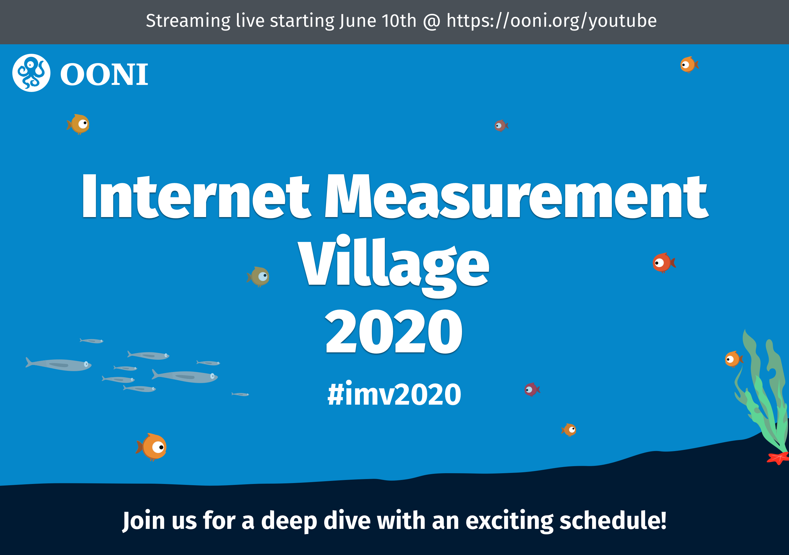

**Figure 1.** _Censored Planet workshop flyer_
{: .center }

We are excited to bring the first Censored Planet workshop to you.

### Schedule

<table class="table table-striped">
  <thead class="thead-dark">
    <tr>
      <th scope="col">#</th>
      <th scope="col">Topic</th>
      <th scope="col">Speaker</th>
    </tr>
  </thead>
  <tbody>
    <tr>
      <th scope="row">1</th>
      <td>Introducing our lab</td>
      <td>Roya Ensafi</td>
    </tr>
    <tr>
      <th scope="row">2</th>
      <td>Introducing Censored Planet</td>
      <td>Roya Ensafi</td>
    </tr>
    <tr>
      <th scope="row">3</th>
      <td>Measurement techniques and their progrssion</td>
      <td>Ramakrishnan Sundara Raman</td>
    </tr>
    <tr>
      <th scope="row">4</th>
      <td>Raw data and its limitations</td>
      <td>Ramakrishnan Sundara Raman</td>
    </tr>
    <tr>
      <th scope="row">5</th>
      <td>The Censored Planet pipeline</td>
      <td>Ramakrishnan Sundara Raman</td>
    </tr>  
    <tr>
      <th scope="row">6</th>
      <td>Introducing the dashboard</td>
      <td>Apurva Virkud</td>
    </tr>    
    <tr>
      <th scope="row">7</th>
      <td>Censored Planet's Machine Learning approach</td>
      <td>Elisa Tsai</td>
    </tr>        
  </tbody>
</table>
