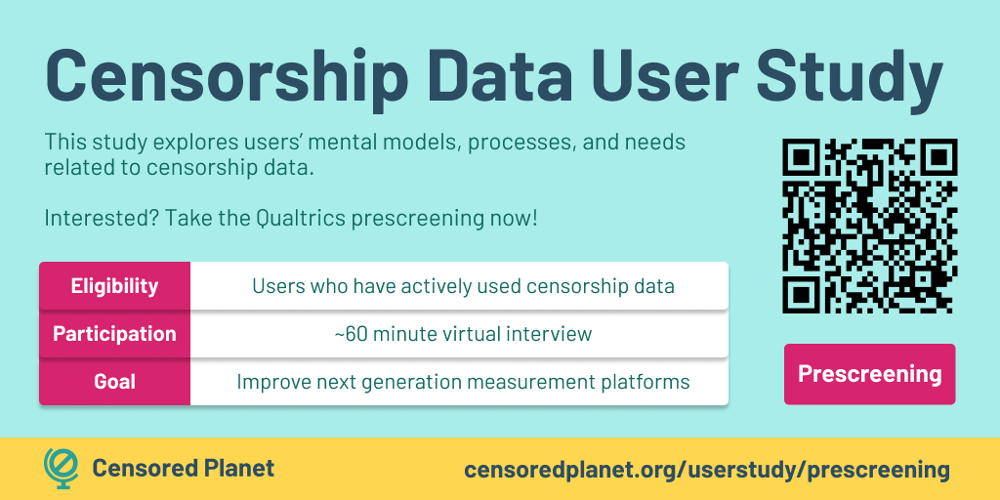

## Overview

Our study explores users' mental models, processes, and needs related to censorship data. Censorship data users are diverse, including technical researchers, journalists, and activists among others; and determining how users use and understand censorship data has not been formalized. We aim to understand user needs and challenges, and identify where improvements towards the usability of censorship data can be made.

**Eligibility:** We are looking for adults (18+) who have actively used censorship data.

**Participation:** Participants will take part in a ~1 hour online interview over Zoom. Our **[interview consent form](/assets/HUM00206077_consentform.pdf)** contains more information about the study procedures. The consent form is provided here to help you decide if you are interested in participating in the study. Note that selected participants will be explicitly asked for consent before their interview.

If you are eligible and interested in participating, please fill out the **[prescreening](/userstudy/prescreening)** to indicate your interest. We will reach out to selected prescreening participants to schedule an interview.

**Compensation:** We are not offering compensation for participation in this study.

**Contact:** This study is run by the Censored Planet team at the University of Michigan. If you have any questions about the study, please contact us at **censoredplanet-ux@umich.edu**.

{: .center }