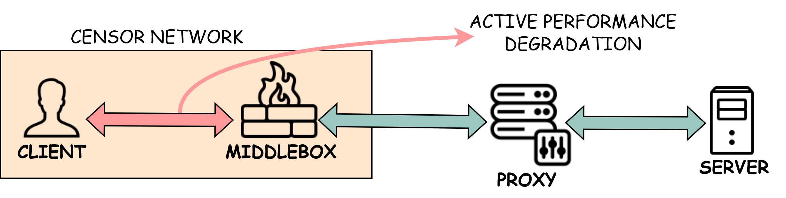
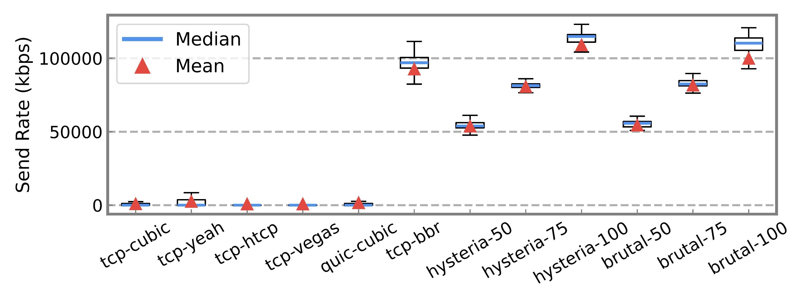
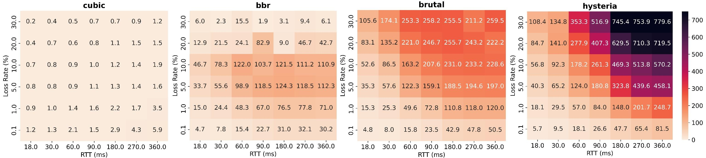
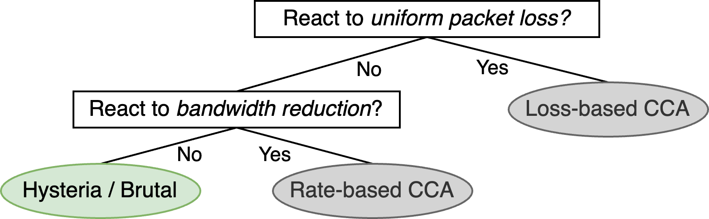
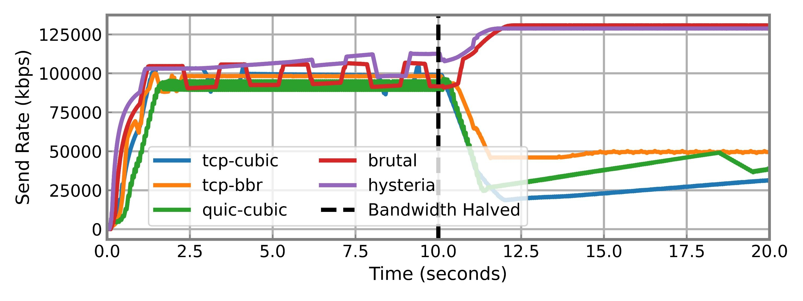
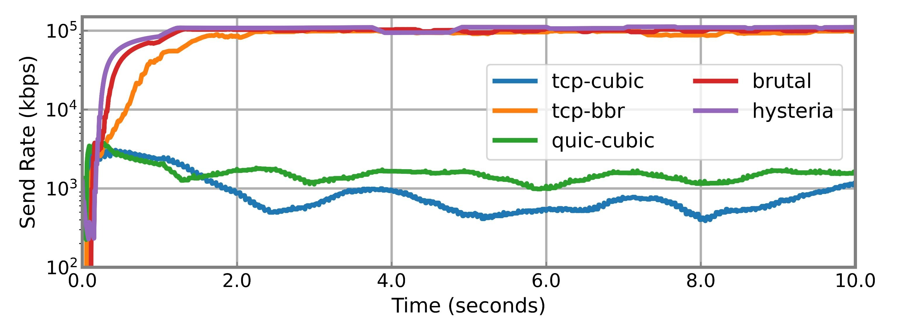

_This post highlights findings discussed in the [FOCI 2025](https://foci.community) paper [Is Custom Congestion Control a Bad Idea for Circumvention Tools?](https://www.petsymposium.org/foci/2025/foci-2025-0001.php)._

## Introduction

Circumvention tools are lifelines for users in censored regions, enabling access to the open web by tunneling traffic through proxies outside restrictive borders. However, these tools often operate in adverse conditions—bandwidth-constrained, lossy networks where traditional protocols struggle to maintain usability. In response, some tools now incorporate custom congestion control algorithms (CCAs) designed to aggressively sustain high throughput despite severe packet loss.

But at what cost? In our research presented at **FOCI 2025**, we explore whether these performance-focused enhancements compromise the **undetectability** of circumvention tools—essentially defeating their purpose.

## The Core Tension: Performance vs. Stealth

Censorship circumvention depends on *blending in*. Tools must appear indistinguishable from ordinary traffic—like video streams or web browsing—so that blocking them would cause unacceptable collateral damage. Custom CCAs such as those in **Hysteria** and **TCP-Brutal** break from this principle. Rather than responding conservatively to congestion signals, they maintain or even *increase* their send rate under loss—anomalous behavior compared to standard TCP or QUIC implementations.

*Figure 1: Our testbed includes a censor-controlled middlebox capable of simulating packet loss and bandwidth restrictions, allowing us to analyze traffic patterns as seen by an adversary.*

## Congestion Control: A Quick Primer

- **Loss-based CCAs** (e.g., TCP Cubic, Reno): Slow down when they detect packet loss, interpreting it as congestion.
- **Rate-based CCAs** (e.g., BBR): Probe for bottlenecks to adjust pacing, generally unaffected by random loss.
- **Custom CCAs** (e.g., Hysteria, TCP-Brutal): Persist with aggressive sending rates, ignoring congestion signals altogether.

## Behavioral Anomalies: The Fingerprintability Problem

We examined whether the behavior of custom CCAs could be exploited for fingerprinting. The answer is yes.

*Figure 2: Box plots show that Hysteria and Brutal maintain higher median and mean throughput than all loss-based CCAs—even under identical loss conditions.*

These behaviors stand out in multiple ways:
- **Throughput under packet loss**: While loss-based CCAs throttle themselves at 5–10% loss, Hysteria and Brutal power through unphased.
- **Deviation from expected behavior**: According to the Mathis Equation, flows should scale throughput with RTT and loss rate. Hysteria and Brutal exceed these estimates—sometimes by factors of 10×.

*Figure 3: Heatmaps reveal how Hysteria and Brutal exceed throughput expectations, especially under high RTT and loss conditions.*

## A Classifier for Detection

To demonstrate the feasibility of detection, we developed a simple two-stage classifier:

1. **Stage 1**: Does the flow respond to uniform packet loss? If yes → likely a loss-based CCA.
2. **Stage 2**: For flows that don't react to loss, does the connection adapt to a sudden bandwidth drop? If yes → BBR. If not → likely Hysteria or Brutal.

*Figure 4: Simple two-question decision tree for classifying CCA type using passive observation of throughput behavior.*

*Figure 5: When bandwidth is halved mid-connection (dotted line), BBR adapts downward. Hysteria and Brutal, by contrast, increase their sending rate.*

## The BBR Alternative

Surprisingly, **BBR** performs comparably to Hysteria and Brutal under moderate loss (under ~20%) but conforms to standard congestion behaviors, making it harder to fingerprint.

*Figure 6: On a log scale, BBR and the custom CCAs appear similar at first glance. However, BBR adapts under throttling while custom CCAs continue to push.*

This makes BBR a promising alternative: it offers improved throughput over traditional TCP without deviating so far from the norm that it becomes an easy target.

## Implications for Developers

Our findings suggest a cautionary stance:
- **Custom CCAs** offer impressive performance but create easily identifiable traffic patterns.
- **Censorship arms races** reward tools that blend in—not those that stand out.

We recommend:
- Favoring **standard, well-tested CCAs** like BBR.
- Exploring **obfuscation strategies** that can mask aggressive behavior.
- Conducting **adversarial evaluations** before deployment in real-world settings.

## Conclusion

Performance and stealth are not always compatible. As circumvention tools evolve, developers must weigh the temptation of speed against the existential risk of detection. In censorship contexts, the best tool is the one that *stays unblocked*—not just the one that’s fastest.
